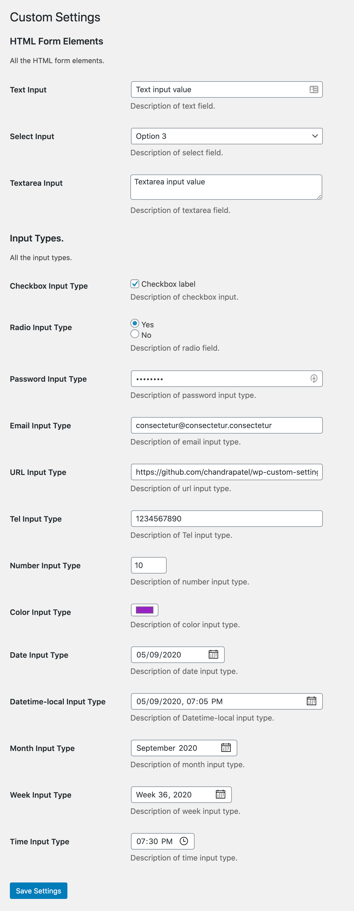

# WP Custom Settings

Allows developers to create a custom admin menu page with settings using Settings API without registering callbacks to every settings section and field.

## Supported form elements and input types

- Textarea
- Select
- Input Types
  - Text
  - Password
  - Email
  - Url
  - Tel
  - Number
  - Color
  - Date
  - Datetime-local
  - Month
  - Week
  - Time

**Note:** I'd suggest to add WP Custom Settings main file in your theme or plugin instead of adding as standalone plugin. This way you can modify it as per your need and avoid dependency.

## Usage

You need to create an object of `WP_Custom_Settings` class and it accepts three arguments to create menu page, register setting and sections & fields.

Please check [example.php](https://github.com/chandrapatel/wp-custom-settings/blob/master/example.php) file.

```php
$custom_settings = new WP_Custom_Settings(
	// Arguments to add menu page. Following arguments are same as add_menu_page() function arguments.
	// Callback argument does not needed.
	[
		'page_title' => __( 'Custom Settings', 'wp-custom-settings' ),
		'menu_title' => __( 'Custom Settings', 'wp-custom-settings' ),
		'capability' => 'manage_options',
		'menu_slug'  => 'wp-custom-settings-page',
		'icon_url'   => '',
		'position'   => null,
	],
	// Arguments to register setting. Following arguments are same as register_setting() function arguments.
	[
		'option_group' => 'wp_custom_settings_group',
		'option_name'  => 'wp_custom_settings_options',
		'args'         => array(
			'type'              => 'array',
			'description'       => 'Description of Custom Settings.',
			'show_in_rest'      => true,
			'default'           => array(),
			'sanitize_callback' => null,
		),
	],
	// Arguments to add sections and fields.
	[
		new WP_Custom_Settings_Section(
			'wp_custom_settings_section', // ID.
			__( 'Section Title.', 'wp-custom-settings' ), // Title.
			__( 'Section Description.', 'wp-custom-settings' ), // Description.
			[
				new WP_Custom_Settings_Field(
					'text', // Field type.
					'wp_custom_settings_field', // ID. Also, it will used for "name" attribute.
					__( 'Field Title', 'wp-settings-api-wrapper' ), // Title.
					[ // Pass additional arguments.
						'description' => 'Description of Custom Settings.',
						'label_for'   => 'wp_custom_settings_field',
						'class'       => 'regular-text',
					]
				),
			]
		),
	]
);
```

## Screenshot


